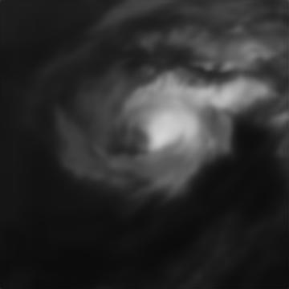
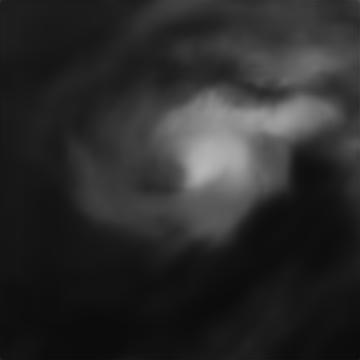
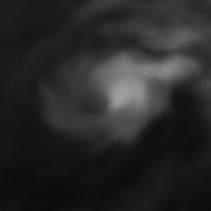

# The Day After Tomorrow  🌪️

## Project Overview 📊
This project aims to develop a Machine Learning/Deep Learning-based solution for predicting future states of storms using satellite imagery. Given data from a specific storm, the model will generate images for 3 future satellite images and predict future wind speeds💨.

## Dataset  📁
The training dataset consists of satellite images of 30 tropical storms around the Atlantic and East Pacific Oceans 🌊. Each storm has a varying number of time samples with irregular time intervals.

### Features
- Storm ID
- Ocean (1 for Atlantic, 2 for East Pacific)
- Timestamp

### Label
- Wind Speed (in knots)

## Task 1: Image Prediction 🖼️
Given satellite images from a particular storm, the model should generate 3 future satellite images at 3 given future timestamps.

### Model Training 🛠️
We use a sequence of images as our input, `Task1.ipnyb`, We trained the model on the whole data, the model is a combined CNN, ConvLSTM and Transpose Convolution with a SSIM loss function. See `task1_package/best_model.pth`

### Evaluation 📝
We compared visually the generated images with the target and we used the SSIM loss value to asses our model performance. 

## Task 2: Wind Speed Prediction  🌪️
We built a model to predict wind speeds based on the training data provided. Each time sample in a storm's data has an associated image and wind speed. See the notebook `windspeed_notebook.ipnyb`

### Data Loading 🔄
To load the features, `import load_json_data from dataloader`

To load the images, `import load_img_data from dataloader`

### Model Training 🛠️
We combined a LSTM for the timestamp and CNN for the images with Linear Regression as a final process see `speed/model_structure.py` and `speed/model_train_test.py`

### Evaluation 📊
We used MSE to asses the wind speed prediction model. see `model_test` in `speed/model_train_test.py`

## Test Storm Challenge 📋
A new storm dataset has been released for retraining or evaluating the models. The models have predicted 3 future images and 13 wind speeds for this surprise storm.

### Predictions 🔮
For the image generation we updated our model to predict the images for the next 3 time steps instead of 1. We also added the new storm data to the 30 other storms data to retrain our model. 

To predict the wind speed we trained our model on the new suprise storm data, we adjusted our model by removing the previous wind speeds as an input. We only used the images and relative time as inputs. See `task2_workflow.ipynb`

### Results 📋
Find the wind speed prediction: `jocelyn_windpredictions.csv`

The 3 predicted images:
  

## Automated testing 🧪

To run the pytest test suite, from the base directory run
```
pytest tests/
```

## Installation and Usage 💻
Follow these instructions on how to set up and run our models, including any required dependencies.

```bash
# Example installation steps
git clone https://github.com/ese-msc-2023/acds-the-day-after-tomorrow-jocelyn.git
cd acds-the-day-after-tomorrow-jocelyn
pip install -r requirements.txt
# Add more steps as necessary
```
## Statement on Use of AI🧠

We have actively been using ChatGPT for improving our code, debugging, especially for graph generation and visualisation code. 

## References📚

See the `references.md` file

